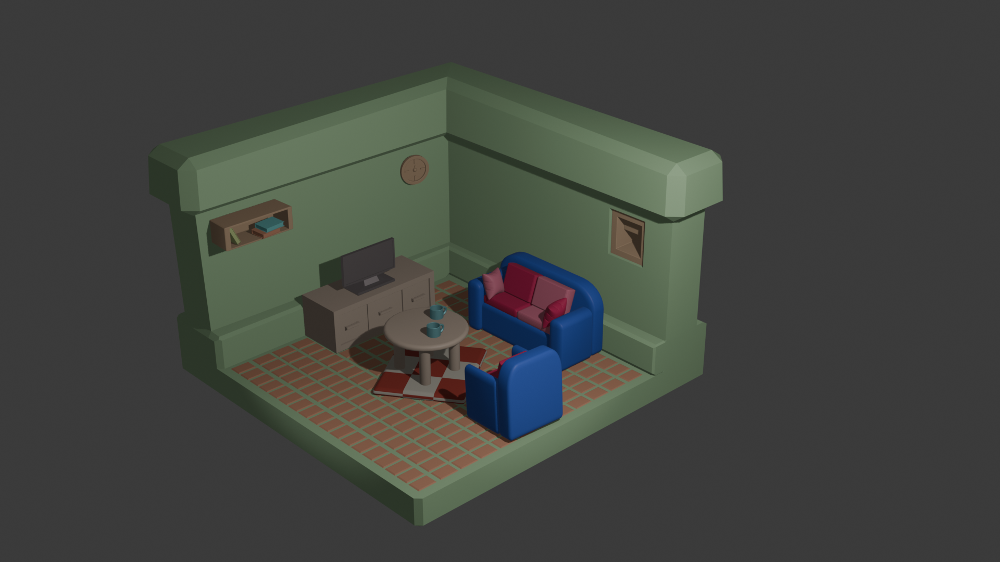

# 🛋️ 3D İzometrik Oda – Blender Projesi

## 📌 Proje Hakkında

Bu proje, **Blender** kullanılarak oluşturulmuş bir **3D izometrik oturma odası sahnesidir**. Çalışma, modelleme sürecinin temel aşamalarını (modelleme, materyal, ışıklandırma, kamera ve render) uygulamalı olarak göstermek amacıyla hazırlanmıştır.

Proje kapsamında hedeflenen; **temiz modelleme**, **düzenli sahne organizasyonu** ve **okunabilir, estetik bir render çıktısı** elde etmektir.

---

## 🎯 Proje Amacı

* 3D sahne oluşturma sürecini baştan sona uygulamak
* Blender’da temel modelleme tekniklerini pekiştirmek
* Materyal, ışık ve kamera kullanımını öğrenmek
* Gerçekçi ve düzenli bir izometrik sahne oluşturmak

---

## 🏠 Sahne Konsepti

**Oturma Odası**

Sahne içerisinde:

* Koltuk takımı (ana obje)
* TV ve TV ünitesi
* Orta sehpa
* Halı
* Duvar rafı ve dekoratif objeler
* Saat ve duvar çerçevesi

---

## 🧱 Kullanılan Teknikler

### 🔹 Modelleme

* Temel mesh objeleri: Cube, Plane, Cylinder
* Edit Mode işlemleri:

  * Move / Scale / Rotate
  * Extrude
  * Inset
  * Loop Cut
* Sahne ölçeklendirme ve hizalama
* Collection ve Outliner ile sahne düzeni

---

### 🔹 Modifier Kullanımı

Projede aşağıdaki modifier’lar kullanılmıştır:

* **Bevel** → Kenar yumuşatma
* **Solidify** → Kalınlık verme
* **Subdivision Surface** → Daha pürüzsüz yüzeyler
* **Array** → Tekrarlayan objeler

---

### 🎨 Materyal & Shading

* Tüm objelere **node tabanlı materyal** atanmıştır
* Kullanılan parametreler:

  * Base Color
  * Roughness
  * Metallic
* Shader Editor aktif şekilde kullanılmıştır

---

### 💡 Işıklandırma

* **Area Light** → Genel aydınlatma
* **Sun Light** → Sahneye yönlü ışık
* Gerekli yerlerde yardımcı ışıklar kullanılmıştır
* Amaç: Sahnenin karanlık kalmadan tüm objelerin net görünmesi

---

### 🎥 Kamera & Render

* İzometrik açıya uygun kamera konumlandırması
* Tüm objelerin kadraj içinde kalması sağlanmıştır
* Render Motoru: **Eevee**
* Çıktı Formatı: PNG

---

## 📷 Render Çıktısı

> Projeye ait final render:



---

## 📁 Dosya Yapısı

```
📦 Proje
 ┣ 📜 Tugba_Saridas_IzometrikOda.blend
 ┣ 🖼️ Tugba_Saridas_Render1.png
 ┗ 📄 README.md
```

---

## ⚙️ Gereksinimler

Projeyi çalıştırmak için:

* Blender (tercihen 4.x veya üzeri)
* Orta seviye bir bilgisayar (Eevee için yeterli)

---

## 🚀 Nasıl Çalıştırılır?

1. Bu repoyu klonla:

   ```bash
   git clone https://github.com/tugbasaridas/mini-katalog-flutter
   ```
2. `.blend` dosyasını Blender ile aç
3. Render almak için:

   * `F12` tuşuna bas

---

## 📚 Kazanımlar

Bu proje ile:

* 3D modelleme mantığını öğrendim
* Sahne organizasyonu ve düzenini geliştirdim
* Işık ve materyal kullanımını deneyimledim
* İzometrik kamera kurulumu yaptım

---


## ✨ Not

Bu proje, Software Persona yazılım stajı  kapsamında verilen yönerge doğrultusunda hazırlanmıştır.
